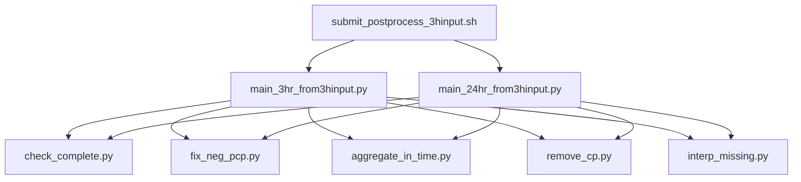

# CMIP postprocessing workflow

This collection of scripts takes 1h / 3h ICAR output files and:
   - check incomplete
       -  interpolate missing timesteps / fill?  ( ToDo - wishlist)
   - checks for- and corrects negative precipitation that could have been introduced by an earlier bug in ICAR.
   - aggregates to monthly (3hr timestep) files / yearly (24hr timestep) files
   - removes GCM convective precipitation (requires GCM cp on ICAR grid -interpolated to desired output temporal resolution (i.e. 3hr or 24hr))

## Usage:
- separate workflows depending on input timestep of the ICAR data: 1hour or 3hour
    - 1 hour assumes yearly input folders (as produced by icar postprocessing script `archive_files.sh`)
- called from job submit scripts submit_postprocess[_XXX].sh
- takes arguments: path_in, path_out, year, model, scenario, remove_cp, GCM_path. These are set in the job submission script.

### workflow diagram

## Other
there is a dedicated GIT branch for use on PNNL's Perlmutter system.
Future users are encouraged to make a separate branch for different HPC systems.